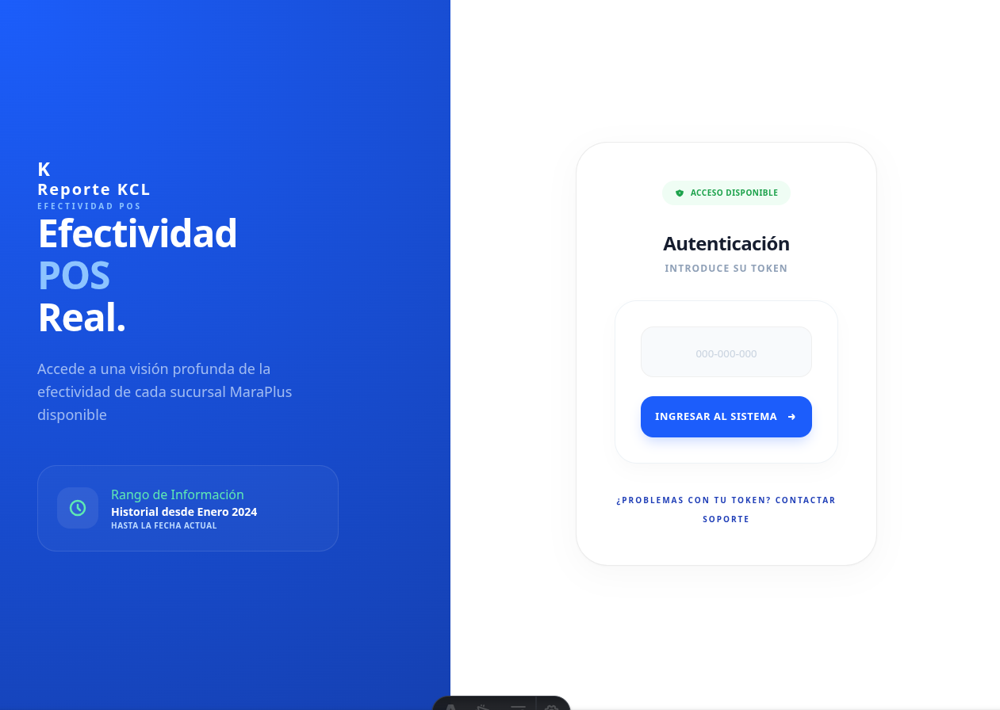
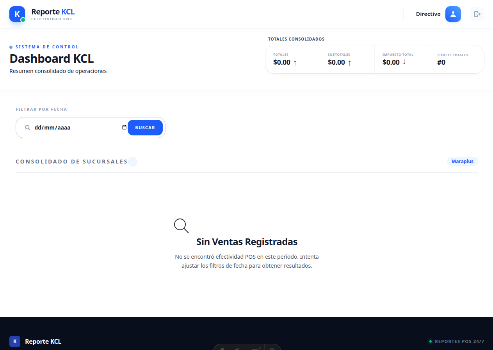
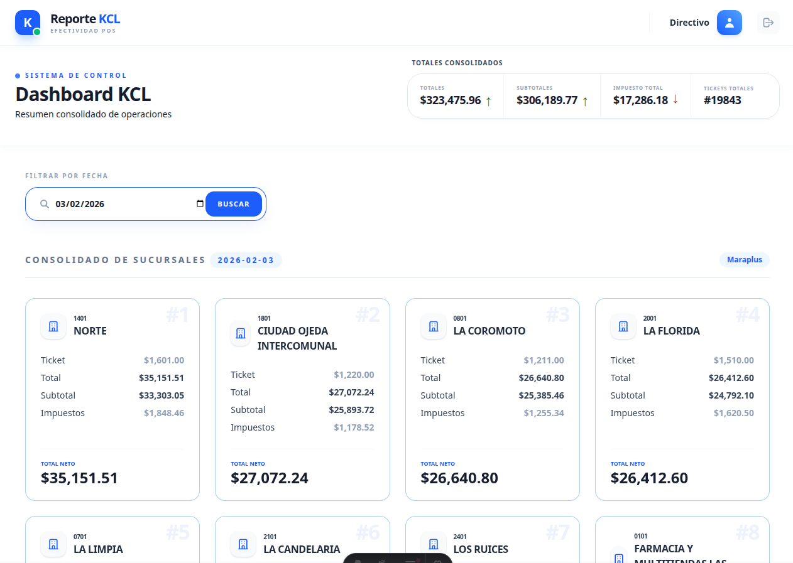
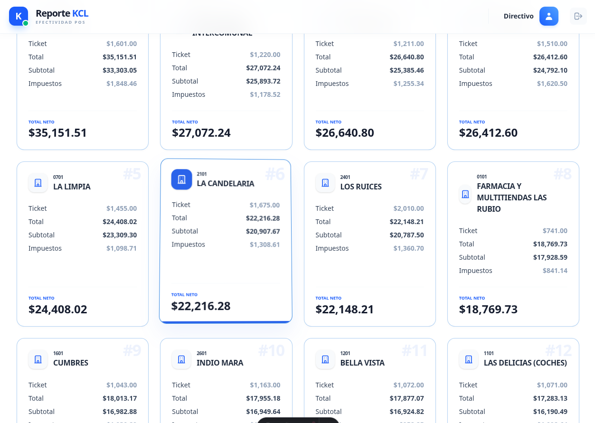
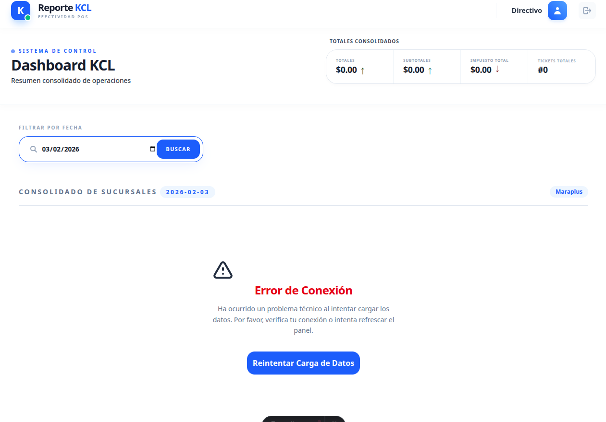
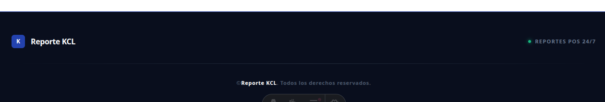

# Reporte KCL

## Resumen del Proyecto
Este proyecto es una solución de visualización de datos financieros diseñada para la corporación **Maraplus**. El sistema permite monitorear el rendimiento económico de cada sucursal en tiempo real, centralizando la información de ventas diarias en un entorno seguro y accesible.

### Funcionamiento Técnico
1. **Script de Extracción:** Procesa las ventas diarias de todas las tiendas.
2. **Almacenamiento:** Los datos se cargan en una base de datos **PostgreSQL**.
3. **API (Backend):** Un servicio desarrollado en **NestJS** expone los datos mediante una autenticación basada en tokens.
4. **Cliente (Frontend):** Una interfaz ligera y rápida construida con **Astro**.

---

## Stack Tecnológico

* **Frontend:** [Astro](https://astro.build/) (Vanilla, sin frameworks de JS adicionales).
* **Estilos:** [Tailwind CSS](https://tailwindcss.com/) para un diseño responsivo y moderno.
* **Backend:** [NestJS](https://nestjs.com/) (Proyecto independiente).
* **Base de Datos:** PostgreSQL.

---

## Desarrollo Asistido por IA (DeepSeek)

Como desarrollador enfocado en **Backend**, utilicé un flujo de trabajo basado en **Prompt Engineering** con **DeepSeek** para la creación de la interfaz de usuario. Esto me permitió obtener un diseño limpio, profesional y adaptado a dispositivos móviles sin desviar el foco de la lógica del servidor.

---

## Bitácora de Prompts (Ingeniería de Instrucciones)

Para lograr el diseño actual, se realizaron iteraciones específicas con la IA. Aquí algunos ejemplos del proceso:

*
    > *"Estoy iniciando una aplicación con Astro y Tailwind CSS (únicamente Astro). Necesito un diseño dinámico con efectos y una paleta de colores en azules y verdes. Haz una página de login compacta donde se solicite un token de autenticación con instrucciones claras para el cliente."*

*
    > *"Crea el layout de usuario autenticado. Navbar con título 'KCL', un filtro por fecha y una sección de cards para datos financieros (Total, Sub-total, Impuestos). Las primeras tres cards deben resaltar como un 'Top 3' de mejores sucursales."*

*
    > *"Haz el formulario más marcado para que el usuario aprecie claramente el área de input. Ajusta los botones a un azul intenso y asegúrate de que el fondo del cuerpo sea blanco para mantener la limpieza visual."*

---

## Conclusión
Este repositorio demuestra la eficiencia de utilizar **Astro** para sitios estáticos de alto rendimiento y cómo la **IA** puede potenciar la productividad de un desarrollador para cubrir áreas fuera de su especialidad técnica (Frontend/Diseño).

---
| Comando | Acción |
| :--- | :--- |
| `npm run dev` | Inicia el servidor de desarrollo en local. |
| `npm run build` | Compila el proyecto para producción. |
| `npm run preview` | Previsualiza la compilación de producción localmente. |
| `npm run astro` | Ejecuta comandos directos de la CLI de Astro. |

---
**Desarrollado por un Backend Developer con el poder de la IA.**

# Screenshot

Login, por token o codigo de acceso donde el cliente introducia su codigo asignado para
validar su usuario o session en esta caso para servirle la informacion

Pantalla inicial despues de pasar la autenticacion por el token

Resultado/Error despues de una busqueda filtrada por fecha

Resultado despues de una busqueda filtrada por fecha

Footer
